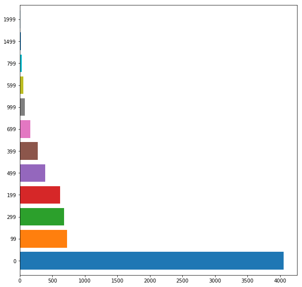
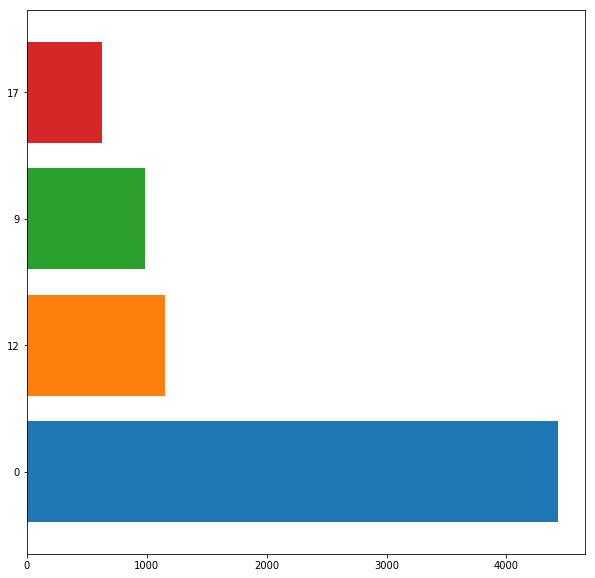

.. code:: ipython3

    import pandas as pd
    import numpy as np
    import matplotlib.pyplot as plt
    import seaborn as sns

.. code:: ipython3

    store = pd.read_csv('http://knuth.luther.edu/~sturza01/AppleStore.csv')
    store

.. raw:: html

    

    
    <table border="1" class="dataframe">
      <thead>
        <tr style="text-align: right;">
          <th></th>
          <th>Unnamed: 0</th>
          <th>id</th>
          <th>app</th>
          <th>size</th>
          <th>currency</th>
          <th>price</th>
          <th>reviews</th>
          <th>rating_count_ver</th>
          <th>rating</th>
          <th>user_rating_ver</th>
          <th>ver</th>
          <th>cont_rating</th>
          <th>Genre</th>
          <th>sup_devices.num</th>
          <th>ipadSc_urls.num</th>
          <th>lang.num</th>
          <th>vpp_lic</th>
        </tr>
      </thead>
      <tbody>
        <tr>
          <th>0</th>
          <td>1</td>
          <td>281656475</td>
          <td>PAC-MAN Premium</td>
          <td>100788224</td>
          <td>USD</td>
          <td>399</td>
          <td>21292</td>
          <td>26</td>
          <td>4.0</td>
          <td>4.5</td>
          <td>6.3.5</td>
          <td>0</td>
          <td>Games</td>
          <td>38</td>
          <td>5</td>
          <td>10</td>
          <td>1</td>
        </tr>
        <tr>
          <th>1</th>
          <td>2</td>
          <td>281796108</td>
          <td>Evernote - stay organized</td>
          <td>158578688</td>
          <td>USD</td>
          <td>0</td>
          <td>161065</td>
          <td>26</td>
          <td>4.0</td>
          <td>3.5</td>
          <td>8.2.2</td>
          <td>0</td>
          <td>Productivity</td>
          <td>37</td>
          <td>5</td>
          <td>23</td>
          <td>1</td>
        </tr>
        <tr>
          <th>2</th>
          <td>3</td>
          <td>281940292</td>
          <td>WeatherBug - Local Weather, Radar, Maps, Alerts</td>
          <td>100524032</td>
          <td>USD</td>
          <td>0</td>
          <td>188583</td>
          <td>2822</td>
          <td>3.5</td>
          <td>4.5</td>
          <td>5.0.0</td>
          <td>0</td>
          <td>Weather</td>
          <td>37</td>
          <td>5</td>
          <td>3</td>
          <td>1</td>
        </tr>
        <tr>
          <th>3</th>
          <td>4</td>
          <td>282614216</td>
          <td>eBay: Best App to Buy, Sell, Save! Online Shop...</td>
          <td>128512000</td>
          <td>USD</td>
          <td>0</td>
          <td>262241</td>
          <td>649</td>
          <td>4.0</td>
          <td>4.5</td>
          <td>5.10.0</td>
          <td>12</td>
          <td>Shopping</td>
          <td>37</td>
          <td>5</td>
          <td>9</td>
          <td>1</td>
        </tr>
        <tr>
          <th>4</th>
          <td>5</td>
          <td>282935706</td>
          <td>Bible</td>
          <td>92774400</td>
          <td>USD</td>
          <td>0</td>
          <td>985920</td>
          <td>5320</td>
          <td>4.5</td>
          <td>5.0</td>
          <td>7.5.1</td>
          <td>0</td>
          <td>Reference</td>
          <td>37</td>
          <td>5</td>
          <td>45</td>
          <td>1</td>
        </tr>
        <tr>
          <th>5</th>
          <td>6</td>
          <td>283619399</td>
          <td>Shanghai Mahjong</td>
          <td>10485713</td>
          <td>USD</td>
          <td>99</td>
          <td>8253</td>
          <td>5516</td>
          <td>4.0</td>
          <td>4.0</td>
          <td>1.8</td>
          <td>0</td>
          <td>Games</td>
          <td>47</td>
          <td>5</td>
          <td>1</td>
          <td>1</td>
        </tr>
        <tr>
          <th>6</th>
          <td>7</td>
          <td>283646709</td>
          <td>PayPal - Send and request money safely</td>
          <td>227795968</td>
          <td>USD</td>
          <td>0</td>
          <td>119487</td>
          <td>879</td>
          <td>4.0</td>
          <td>4.5</td>
          <td>6.12.0</td>
          <td>0</td>
          <td>Finance</td>
          <td>37</td>
          <td>0</td>
          <td>19</td>
          <td>1</td>
        </tr>
        <tr>
          <th>7</th>
          <td>8</td>
          <td>284035177</td>
          <td>Pandora - Music &amp; Radio</td>
          <td>130242560</td>
          <td>USD</td>
          <td>0</td>
          <td>1126879</td>
          <td>3594</td>
          <td>4.0</td>
          <td>4.5</td>
          <td>8.4.1</td>
          <td>12</td>
          <td>Music</td>
          <td>37</td>
          <td>4</td>
          <td>1</td>
          <td>1</td>
        </tr>
        <tr>
          <th>8</th>
          <td>9</td>
          <td>284666222</td>
          <td>PCalc - The Best Calculator</td>
          <td>49250304</td>
          <td>USD</td>
          <td>999</td>
          <td>1117</td>
          <td>4</td>
          <td>4.5</td>
          <td>5.0</td>
          <td>3.6.6</td>
          <td>0</td>
          <td>Utilities</td>
          <td>37</td>
          <td>5</td>
          <td>1</td>
          <td>1</td>
        </tr>
        <tr>
          <th>9</th>
          <td>10</td>
          <td>284736660</td>
          <td>Ms. PAC-MAN</td>
          <td>70023168</td>
          <td>USD</td>
          <td>399</td>
          <td>7885</td>
          <td>40</td>
          <td>4.0</td>
          <td>4.0</td>
          <td>4.0.4</td>
          <td>0</td>
          <td>Games</td>
          <td>38</td>
          <td>0</td>
          <td>10</td>
          <td>1</td>
        </tr>
        <tr>
          <th>10</th>
          <td>11</td>
          <td>284791396</td>
          <td>Solitaire by MobilityWare</td>
          <td>49618944</td>
          <td>USD</td>
          <td>499</td>
          <td>76720</td>
          <td>4017</td>
          <td>4.5</td>
          <td>4.5</td>
          <td>4.10.1</td>
          <td>0</td>
          <td>Games</td>
          <td>38</td>
          <td>4</td>
          <td>11</td>
          <td>1</td>
        </tr>
        <tr>
          <th>11</th>
          <td>12</td>
          <td>284815117</td>
          <td>SCRABBLE Premium</td>
          <td>227547136</td>
          <td>USD</td>
          <td>799</td>
          <td>105776</td>
          <td>166</td>
          <td>3.5</td>
          <td>2.5</td>
          <td>5.19.0</td>
          <td>0</td>
          <td>Games</td>
          <td>37</td>
          <td>0</td>
          <td>6</td>
          <td>1</td>
        </tr>
        <tr>
          <th>12</th>
          <td>13</td>
          <td>284815942</td>
          <td>Google – Search made just for mobile</td>
          <td>179979264</td>
          <td>USD</td>
          <td>0</td>
          <td>479440</td>
          <td>203</td>
          <td>3.5</td>
          <td>4.0</td>
          <td>27</td>
          <td>17</td>
          <td>Utilities</td>
          <td>37</td>
          <td>4</td>
          <td>33</td>
          <td>1</td>
        </tr>
        <tr>
          <th>13</th>
          <td>14</td>
          <td>284847138</td>
          <td>Bank of America - Mobile Banking</td>
          <td>160925696</td>
          <td>USD</td>
          <td>0</td>
          <td>119773</td>
          <td>2336</td>
          <td>3.5</td>
          <td>4.5</td>
          <td>7.3.8</td>
          <td>0</td>
          <td>Finance</td>
          <td>37</td>
          <td>0</td>
          <td>2</td>
          <td>1</td>
        </tr>
        <tr>
          <th>14</th>
          <td>15</td>
          <td>284862767</td>
          <td>FreeCell</td>
          <td>55153664</td>
          <td>USD</td>
          <td>499</td>
          <td>6340</td>
          <td>668</td>
          <td>4.5</td>
          <td>4.5</td>
          <td>4.0.3</td>
          <td>0</td>
          <td>Games</td>
          <td>38</td>
          <td>5</td>
          <td>2</td>
          <td>1</td>
        </tr>
        <tr>
          <th>15</th>
          <td>16</td>
          <td>284876795</td>
          <td>TripAdvisor Hotels Flights Restaurants</td>
          <td>207907840</td>
          <td>USD</td>
          <td>0</td>
          <td>56194</td>
          <td>87</td>
          <td>4.0</td>
          <td>3.5</td>
          <td>21.1</td>
          <td>0</td>
          <td>Travel</td>
          <td>37</td>
          <td>1</td>
          <td>26</td>
          <td>1</td>
        </tr>
        <tr>
          <th>16</th>
          <td>17</td>
          <td>284882215</td>
          <td>Facebook</td>
          <td>389879808</td>
          <td>USD</td>
          <td>0</td>
          <td>2974676</td>
          <td>212</td>
          <td>3.5</td>
          <td>3.5</td>
          <td>95</td>
          <td>0</td>
          <td>Social Networking</td>
          <td>37</td>
          <td>1</td>
          <td>29</td>
          <td>1</td>
        </tr>
        <tr>
          <th>17</th>
          <td>18</td>
          <td>284910350</td>
          <td>Yelp - Nearby Restaurants, Shopping &amp; Services</td>
          <td>167407616</td>
          <td>USD</td>
          <td>0</td>
          <td>223885</td>
          <td>3726</td>
          <td>4.0</td>
          <td>4.5</td>
          <td>11.15.0</td>
          <td>12</td>
          <td>Travel</td>
          <td>37</td>
          <td>5</td>
          <td>18</td>
          <td>1</td>
        </tr>
        <tr>
          <th>18</th>
          <td>20</td>
          <td>284993459</td>
          <td>Shazam - Discover music, artists, videos &amp; lyrics</td>
          <td>147093504</td>
          <td>USD</td>
          <td>0</td>
          <td>402925</td>
          <td>136</td>
          <td>4.0</td>
          <td>4.5</td>
          <td>11.0.3</td>
          <td>12</td>
          <td>Music</td>
          <td>37</td>
          <td>3</td>
          <td>16</td>
          <td>1</td>
        </tr>
        <tr>
          <th>19</th>
          <td>21</td>
          <td>285005463</td>
          <td>Crash Bandicoot Nitro Kart 3D</td>
          <td>10735026</td>
          <td>USD</td>
          <td>299</td>
          <td>31456</td>
          <td>4178</td>
          <td>4.0</td>
          <td>3.5</td>
          <td>1.0.0</td>
          <td>0</td>
          <td>Games</td>
          <td>47</td>
          <td>0</td>
          <td>1</td>
          <td>1</td>
        </tr>
        <tr>
          <th>20</th>
          <td>22</td>
          <td>285946052</td>
          <td>iQuran</td>
          <td>70707916</td>
          <td>USD</td>
          <td>199</td>
          <td>2929</td>
          <td>966</td>
          <td>4.5</td>
          <td>4.5</td>
          <td>3.3</td>
          <td>0</td>
          <td>Reference</td>
          <td>43</td>
          <td>0</td>
          <td>2</td>
          <td>1</td>
        </tr>
        <tr>
          <th>21</th>
          <td>23</td>
          <td>285994151</td>
          <td>:) Sudoku +</td>
          <td>6169600</td>
          <td>USD</td>
          <td>299</td>
          <td>11447</td>
          <td>781</td>
          <td>5.0</td>
          <td>5.0</td>
          <td>5.2.6</td>
          <td>0</td>
          <td>Games</td>
          <td>40</td>
          <td>5</td>
          <td>1</td>
          <td>1</td>
        </tr>
        <tr>
          <th>22</th>
          <td>24</td>
          <td>286058814</td>
          <td>Yahoo Sports - Teams, Scores, News &amp; Highlights</td>
          <td>130583552</td>
          <td>USD</td>
          <td>0</td>
          <td>137951</td>
          <td>131</td>
          <td>4.0</td>
          <td>4.5</td>
          <td>6.9</td>
          <td>0</td>
          <td>Sports</td>
          <td>37</td>
          <td>2</td>
          <td>6</td>
          <td>1</td>
        </tr>
        <tr>
          <th>23</th>
          <td>25</td>
          <td>286070473</td>
          <td>Mileage Log | Fahrtenbuch</td>
          <td>71203840</td>
          <td>USD</td>
          <td>599</td>
          <td>8</td>
          <td>0</td>
          <td>4.5</td>
          <td>0.0</td>
          <td>9.0.5</td>
          <td>0</td>
          <td>Business</td>
          <td>37</td>
          <td>5</td>
          <td>3</td>
          <td>1</td>
        </tr>
        <tr>
          <th>24</th>
          <td>27</td>
          <td>286799607</td>
          <td>Cleartune - Chromatic Tuner</td>
          <td>11423008</td>
          <td>USD</td>
          <td>399</td>
          <td>3241</td>
          <td>297</td>
          <td>4.0</td>
          <td>4.0</td>
          <td>2.1.3</td>
          <td>0</td>
          <td>Music</td>
          <td>43</td>
          <td>2</td>
          <td>10</td>
          <td>1</td>
        </tr>
        <tr>
          <th>25</th>
          <td>28</td>
          <td>286906691</td>
          <td>Lifesum – Inspiring healthy lifestyle app</td>
          <td>188017664</td>
          <td>USD</td>
          <td>0</td>
          <td>5795</td>
          <td>12</td>
          <td>3.5</td>
          <td>4.0</td>
          <td>8.4.1</td>
          <td>0</td>
          <td>Health &amp; Fitness</td>
          <td>37</td>
          <td>5</td>
          <td>11</td>
          <td>1</td>
        </tr>
        <tr>
          <th>26</th>
          <td>29</td>
          <td>286911400</td>
          <td>Hangman.</td>
          <td>4765696</td>
          <td>USD</td>
          <td>0</td>
          <td>42316</td>
          <td>248</td>
          <td>3.0</td>
          <td>3.5</td>
          <td>2.0.6</td>
          <td>9</td>
          <td>Games</td>
          <td>38</td>
          <td>0</td>
          <td>1</td>
          <td>1</td>
        </tr>
        <tr>
          <th>27</th>
          <td>31</td>
          <td>288113403</td>
          <td>iTranslate - Language Translator &amp; Dictionary</td>
          <td>287933440</td>
          <td>USD</td>
          <td>0</td>
          <td>123215</td>
          <td>25</td>
          <td>3.5</td>
          <td>5.0</td>
          <td>10.5.4</td>
          <td>0</td>
          <td>Productivity</td>
          <td>37</td>
          <td>5</td>
          <td>23</td>
          <td>1</td>
        </tr>
        <tr>
          <th>28</th>
          <td>32</td>
          <td>288120394</td>
          <td>TouchOSC</td>
          <td>4263936</td>
          <td>USD</td>
          <td>499</td>
          <td>782</td>
          <td>7</td>
          <td>4.0</td>
          <td>3.5</td>
          <td>1.9.8</td>
          <td>0</td>
          <td>Music</td>
          <td>43</td>
          <td>1</td>
          <td>1</td>
          <td>1</td>
        </tr>
        <tr>
          <th>29</th>
          <td>33</td>
          <td>288419283</td>
          <td>RadarScope</td>
          <td>172772352</td>
          <td>USD</td>
          <td>999</td>
          <td>3449</td>
          <td>23</td>
          <td>4.0</td>
          <td>4.5</td>
          <td>3.4.1</td>
          <td>0</td>
          <td>Weather</td>
          <td>37</td>
          <td>5</td>
          <td>1</td>
          <td>1</td>
        </tr>
        <tr>
          <th>...</th>
          <td>...</td>
          <td>...</td>
          <td>...</td>
          <td>...</td>
          <td>...</td>
          <td>...</td>
          <td>...</td>
          <td>...</td>
          <td>...</td>
          <td>...</td>
          <td>...</td>
          <td>...</td>
          <td>...</td>
          <td>...</td>
          <td>...</td>
          <td>...</td>
          <td>...</td>
        </tr>
        <tr>
          <th>7167</th>
          <td>10995</td>
          <td>1182265441</td>
          <td>脱出ゲーム　わたしをみつけて　-おじいさんとわたしの物語-</td>
          <td>177498112</td>
          <td>USD</td>
          <td>0</td>
          <td>1</td>
          <td>1</td>
          <td>1.0</td>
          <td>1.0</td>
          <td>1.0.1</td>
          <td>0</td>
          <td>Games</td>
          <td>38</td>
          <td>4</td>
          <td>1</td>
          <td>1</td>
        </tr>
        <tr>
          <th>7168</th>
          <td>10998</td>
          <td>1182331762</td>
          <td>Escape from the frigid Igloo.</td>
          <td>89188352</td>
          <td>USD</td>
          <td>0</td>
          <td>3</td>
          <td>3</td>
          <td>4.0</td>
          <td>4.0</td>
          <td>1.0.1</td>
          <td>0</td>
          <td>Games</td>
          <td>38</td>
          <td>5</td>
          <td>1</td>
          <td>1</td>
        </tr>
        <tr>
          <th>7169</th>
          <td>11002</td>
          <td>1182568288</td>
          <td>Talking Santa - Video santa claus calls you</td>
          <td>32685056</td>
          <td>USD</td>
          <td>299</td>
          <td>9</td>
          <td>3</td>
          <td>3.0</td>
          <td>3.5</td>
          <td>1.0.1</td>
          <td>0</td>
          <td>Entertainment</td>
          <td>37</td>
          <td>0</td>
          <td>31</td>
          <td>1</td>
        </tr>
        <tr>
          <th>7170</th>
          <td>11010</td>
          <td>1183234072</td>
          <td>CTFxCmoji</td>
          <td>26077184</td>
          <td>USD</td>
          <td>0</td>
          <td>39</td>
          <td>4</td>
          <td>5.0</td>
          <td>5.0</td>
          <td>1.3</td>
          <td>9</td>
          <td>Social Networking</td>
          <td>37</td>
          <td>1</td>
          <td>1</td>
          <td>1</td>
        </tr>
        <tr>
          <th>7171</th>
          <td>11013</td>
          <td>1183260922</td>
          <td>Room Escape Game - Santa's Room</td>
          <td>143346688</td>
          <td>USD</td>
          <td>0</td>
          <td>10</td>
          <td>10</td>
          <td>5.0</td>
          <td>5.0</td>
          <td>1</td>
          <td>0</td>
          <td>Games</td>
          <td>40</td>
          <td>0</td>
          <td>1</td>
          <td>1</td>
        </tr>
        <tr>
          <th>7172</th>
          <td>11016</td>
          <td>1183548754</td>
          <td>Rescue the Enchanter</td>
          <td>242505728</td>
          <td>USD</td>
          <td>399</td>
          <td>55</td>
          <td>29</td>
          <td>4.5</td>
          <td>4.5</td>
          <td>1.4</td>
          <td>0</td>
          <td>Games</td>
          <td>40</td>
          <td>5</td>
          <td>1</td>
          <td>1</td>
        </tr>
        <tr>
          <th>7173</th>
          <td>11019</td>
          <td>1183709176</td>
          <td>My Diary - 你的名字非官方</td>
          <td>18164736</td>
          <td>USD</td>
          <td>99</td>
          <td>0</td>
          <td>0</td>
          <td>0.0</td>
          <td>0.0</td>
          <td>1.1</td>
          <td>0</td>
          <td>Utilities</td>
          <td>37</td>
          <td>0</td>
          <td>1</td>
          <td>1</td>
        </tr>
        <tr>
          <th>7174</th>
          <td>11022</td>
          <td>1183856228</td>
          <td>VR Thrills: Roller Coaster 360 (Google Cardboard)</td>
          <td>169535488</td>
          <td>USD</td>
          <td>0</td>
          <td>14</td>
          <td>4</td>
          <td>4.0</td>
          <td>3.5</td>
          <td>1.3.0</td>
          <td>0</td>
          <td>Games</td>
          <td>37</td>
          <td>5</td>
          <td>1</td>
          <td>1</td>
        </tr>
        <tr>
          <th>7175</th>
          <td>11024</td>
          <td>1183986102</td>
          <td>Santa Kids Hair Salon - Christmas Makeover Games</td>
          <td>64244736</td>
          <td>USD</td>
          <td>0</td>
          <td>41</td>
          <td>19</td>
          <td>4.5</td>
          <td>4.5</td>
          <td>1.3</td>
          <td>0</td>
          <td>Games</td>
          <td>37</td>
          <td>5</td>
          <td>25</td>
          <td>1</td>
        </tr>
        <tr>
          <th>7176</th>
          <td>11027</td>
          <td>1184711626</td>
          <td>Human Juggling Cup</td>
          <td>184324096</td>
          <td>USD</td>
          <td>0</td>
          <td>0</td>
          <td>0</td>
          <td>0.0</td>
          <td>0.0</td>
          <td>1.0.1</td>
          <td>0</td>
          <td>Games</td>
          <td>40</td>
          <td>4</td>
          <td>1</td>
          <td>1</td>
        </tr>
        <tr>
          <th>7177</th>
          <td>11031</td>
          <td>1184800011</td>
          <td>Again - room escape game</td>
          <td>33946624</td>
          <td>USD</td>
          <td>0</td>
          <td>11</td>
          <td>8</td>
          <td>4.0</td>
          <td>4.0</td>
          <td>1.1.0</td>
          <td>0</td>
          <td>Games</td>
          <td>37</td>
          <td>5</td>
          <td>1</td>
          <td>1</td>
        </tr>
        <tr>
          <th>7178</th>
          <td>11033</td>
          <td>1185209084</td>
          <td>Saloons Unleashed</td>
          <td>327731200</td>
          <td>USD</td>
          <td>99</td>
          <td>0</td>
          <td>0</td>
          <td>0.0</td>
          <td>0.0</td>
          <td>1.1</td>
          <td>0</td>
          <td>Games</td>
          <td>37</td>
          <td>5</td>
          <td>1</td>
          <td>1</td>
        </tr>
        <tr>
          <th>7179</th>
          <td>11035</td>
          <td>1185328193</td>
          <td>Fam — Group video calling for iMessage</td>
          <td>113382400</td>
          <td>USD</td>
          <td>0</td>
          <td>279</td>
          <td>5</td>
          <td>3.5</td>
          <td>3.0</td>
          <td>0.6.41</td>
          <td>0</td>
          <td>Social Networking</td>
          <td>37</td>
          <td>4</td>
          <td>1</td>
          <td>1</td>
        </tr>
        <tr>
          <th>7180</th>
          <td>11036</td>
          <td>1185365336</td>
          <td>Laurie Hernandez the Human Emoji</td>
          <td>94008320</td>
          <td>USD</td>
          <td>0</td>
          <td>26</td>
          <td>3</td>
          <td>5.0</td>
          <td>5.0</td>
          <td>1.0.5</td>
          <td>9</td>
          <td>Utilities</td>
          <td>37</td>
          <td>4</td>
          <td>1</td>
          <td>1</td>
        </tr>
        <tr>
          <th>7181</th>
          <td>11038</td>
          <td>1185428381</td>
          <td>剑倚手游</td>
          <td>178160640</td>
          <td>USD</td>
          <td>99</td>
          <td>0</td>
          <td>0</td>
          <td>0.0</td>
          <td>0.0</td>
          <td>1</td>
          <td>9</td>
          <td>Games</td>
          <td>40</td>
          <td>5</td>
          <td>0</td>
          <td>1</td>
        </tr>
        <tr>
          <th>7182</th>
          <td>11040</td>
          <td>1185538497</td>
          <td>camera for filter</td>
          <td>9362432</td>
          <td>USD</td>
          <td>0</td>
          <td>0</td>
          <td>0</td>
          <td>0.0</td>
          <td>0.0</td>
          <td>1.0.3</td>
          <td>0</td>
          <td>Photo &amp; Video</td>
          <td>37</td>
          <td>0</td>
          <td>1</td>
          <td>1</td>
        </tr>
        <tr>
          <th>7183</th>
          <td>11041</td>
          <td>1185580782</td>
          <td>Survivalcraft 2</td>
          <td>57349120</td>
          <td>USD</td>
          <td>399</td>
          <td>292</td>
          <td>292</td>
          <td>4.0</td>
          <td>4.0</td>
          <td>2.0.20.1</td>
          <td>9</td>
          <td>Games</td>
          <td>40</td>
          <td>5</td>
          <td>1</td>
          <td>1</td>
        </tr>
        <tr>
          <th>7184</th>
          <td>11042</td>
          <td>1185731859</td>
          <td>剑客情缘-高爆率高掉落天天疯玩</td>
          <td>171944960</td>
          <td>USD</td>
          <td>0</td>
          <td>0</td>
          <td>0</td>
          <td>0.0</td>
          <td>0.0</td>
          <td>1</td>
          <td>9</td>
          <td>Games</td>
          <td>40</td>
          <td>5</td>
          <td>0</td>
          <td>1</td>
        </tr>
        <tr>
          <th>7185</th>
          <td>11043</td>
          <td>1185777521</td>
          <td>问仙奇遇-新玩法新套装嗨到爆</td>
          <td>208026624</td>
          <td>USD</td>
          <td>99</td>
          <td>0</td>
          <td>0</td>
          <td>0.0</td>
          <td>0.0</td>
          <td>1</td>
          <td>9</td>
          <td>Games</td>
          <td>38</td>
          <td>5</td>
          <td>1</td>
          <td>1</td>
        </tr>
        <tr>
          <th>7186</th>
          <td>11050</td>
          <td>1186108496</td>
          <td>脱出ゲーム - 書道教室 -  "漢字"の謎に満ちた部屋からの 脱出</td>
          <td>85580800</td>
          <td>USD</td>
          <td>0</td>
          <td>1</td>
          <td>1</td>
          <td>2.0</td>
          <td>2.0</td>
          <td>1.0.1</td>
          <td>0</td>
          <td>Games</td>
          <td>38</td>
          <td>5</td>
          <td>1</td>
          <td>1</td>
        </tr>
        <tr>
          <th>7187</th>
          <td>11051</td>
          <td>1186126548</td>
          <td>Escape Game: illumination</td>
          <td>52342784</td>
          <td>USD</td>
          <td>0</td>
          <td>23</td>
          <td>23</td>
          <td>4.5</td>
          <td>4.5</td>
          <td>1</td>
          <td>0</td>
          <td>Games</td>
          <td>37</td>
          <td>5</td>
          <td>2</td>
          <td>1</td>
        </tr>
        <tr>
          <th>7188</th>
          <td>11060</td>
          <td>1186384912</td>
          <td>Demolition Derby Virtual Reality (VR) Racing</td>
          <td>168774656</td>
          <td>USD</td>
          <td>0</td>
          <td>18</td>
          <td>18</td>
          <td>4.0</td>
          <td>4.0</td>
          <td>1.0.0</td>
          <td>12</td>
          <td>Games</td>
          <td>38</td>
          <td>4</td>
          <td>1</td>
          <td>1</td>
        </tr>
        <tr>
          <th>7189</th>
          <td>11074</td>
          <td>1187128255</td>
          <td>飞刀传奇-动作武侠热血江湖即时PK传奇（登录爆金装）</td>
          <td>537462784</td>
          <td>USD</td>
          <td>99</td>
          <td>0</td>
          <td>0</td>
          <td>0.0</td>
          <td>0.0</td>
          <td>2.1.0</td>
          <td>9</td>
          <td>Games</td>
          <td>38</td>
          <td>5</td>
          <td>1</td>
          <td>1</td>
        </tr>
        <tr>
          <th>7190</th>
          <td>11077</td>
          <td>1187279979</td>
          <td>Add-Ons Studio for Minecraft</td>
          <td>22999040</td>
          <td>USD</td>
          <td>299</td>
          <td>97</td>
          <td>97</td>
          <td>3.0</td>
          <td>3.0</td>
          <td>1</td>
          <td>0</td>
          <td>Games</td>
          <td>37</td>
          <td>5</td>
          <td>3</td>
          <td>1</td>
        </tr>
        <tr>
          <th>7191</th>
          <td>11079</td>
          <td>1187282363</td>
          <td>Plead the Fifth - The Game</td>
          <td>27853824</td>
          <td>USD</td>
          <td>299</td>
          <td>11</td>
          <td>0</td>
          <td>4.0</td>
          <td>0.0</td>
          <td>1.1.1</td>
          <td>17</td>
          <td>Games</td>
          <td>37</td>
          <td>0</td>
          <td>1</td>
          <td>1</td>
        </tr>
        <tr>
          <th>7192</th>
          <td>11081</td>
          <td>1187617475</td>
          <td>Kubik</td>
          <td>126644224</td>
          <td>USD</td>
          <td>0</td>
          <td>142</td>
          <td>75</td>
          <td>4.5</td>
          <td>4.5</td>
          <td>1.3</td>
          <td>0</td>
          <td>Games</td>
          <td>38</td>
          <td>5</td>
          <td>1</td>
          <td>1</td>
        </tr>
        <tr>
          <th>7193</th>
          <td>11082</td>
          <td>1187682390</td>
          <td>VR Roller-Coaster</td>
          <td>120760320</td>
          <td>USD</td>
          <td>0</td>
          <td>30</td>
          <td>30</td>
          <td>4.5</td>
          <td>4.5</td>
          <td>0.9</td>
          <td>0</td>
          <td>Games</td>
          <td>38</td>
          <td>0</td>
          <td>1</td>
          <td>1</td>
        </tr>
        <tr>
          <th>7194</th>
          <td>11087</td>
          <td>1187779532</td>
          <td>Bret Michaels Emojis + Lyric Keyboard</td>
          <td>111322112</td>
          <td>USD</td>
          <td>199</td>
          <td>15</td>
          <td>0</td>
          <td>4.5</td>
          <td>0.0</td>
          <td>1.0.2</td>
          <td>9</td>
          <td>Utilities</td>
          <td>37</td>
          <td>1</td>
          <td>1</td>
          <td>1</td>
        </tr>
        <tr>
          <th>7195</th>
          <td>11089</td>
          <td>1187838770</td>
          <td>VR Roller Coaster World - Virtual Reality</td>
          <td>97235968</td>
          <td>USD</td>
          <td>0</td>
          <td>85</td>
          <td>32</td>
          <td>4.5</td>
          <td>4.5</td>
          <td>1.0.15</td>
          <td>12</td>
          <td>Games</td>
          <td>38</td>
          <td>0</td>
          <td>2</td>
          <td>1</td>
        </tr>
        <tr>
          <th>7196</th>
          <td>11097</td>
          <td>1188375727</td>
          <td>Escape the Sweet Shop Series</td>
          <td>90898432</td>
          <td>USD</td>
          <td>0</td>
          <td>3</td>
          <td>3</td>
          <td>5.0</td>
          <td>5.0</td>
          <td>1</td>
          <td>0</td>
          <td>Games</td>
          <td>40</td>
          <td>0</td>
          <td>2</td>
          <td>1</td>
        </tr>
      </tbody>
    </table>
    
7197 rows × 17 columns

    

.. code:: ipython3

    store['size'].mean()

.. parsed-literal::

    199134453.825066

Bar Chart for Count of each amount of Price
-------------------------------------------

.. code:: ipython3

    criteria1 = store.price > 0
    paidapps = store[criteria1]
    paidapps.index

.. parsed-literal::

    Int64Index([   0,    5,    8,    9,   10,   11,   14,   19,   20,   21,
                ...
                7172, 7173, 7178, 7181, 7183, 7185, 7189, 7190, 7191, 7194],
               dtype='int64', length=3141)

.. code:: ipython3

    paidappcount = store["price"].value_counts()
    paidappcount.head()

.. parsed-literal::

    0      4056
    99      728
    299     683
    199     621
    499     394
    Name: price, dtype: int64

.. code:: ipython3

    multiapp = paidappcount[paidappcount.values > 10]
    multiapp.index

.. parsed-literal::

    Int64Index([0, 99, 299, 199, 499, 399, 699, 999, 599, 799, 1499, 1999], dtype='int64')

.. code:: ipython3

    multiapp.plot(kind="barh", width=0.8, figsize=(10,10))

.. parsed-literal::

    <matplotlib.axes._subplots.AxesSubplot at 0x7f518df02908>

Total Price of Paid Apps in each Genre
--------------------------------------

.. code:: ipython3

    storeprod = store[["Genre","price"]]

.. code:: ipython3

    TotalPriceByGenre = storeprod.groupby(["Genre"]).sum().sort_values("price", ascending=False).head(10)

.. code:: ipython3

    TotalPriceByGenre

.. raw:: html

    

    
    <table border="1" class="dataframe">
      <thead>
        <tr style="text-align: right;">
          <th></th>
          <th>price</th>
        </tr>
        <tr>
          <th>Genre</th>
          <th></th>
        </tr>
      </thead>
      <tbody>
        <tr>
          <th>Games</th>
          <td>553395</td>
        </tr>
        <tr>
          <th>Education</th>
          <td>182479</td>
        </tr>
        <tr>
          <th>Productivity</th>
          <td>77084</td>
        </tr>
        <tr>
          <th>Music</th>
          <td>66729</td>
        </tr>
        <tr>
          <th>Photo &amp; Video</th>
          <td>51418</td>
        </tr>
        <tr>
          <th>Entertainment</th>
          <td>47599</td>
        </tr>
        <tr>
          <th>Utilities</th>
          <td>40861</td>
        </tr>
        <tr>
          <th>Health &amp; Fitness</th>
          <td>34496</td>
        </tr>
        <tr>
          <th>Reference</th>
          <td>30956</td>
        </tr>
        <tr>
          <th>Business</th>
          <td>29163</td>
        </tr>
      </tbody>
    </table>
    

.. code:: ipython3

    TotalPriceByGenre.plot(kind="barh", width=0.8, figsize=(10,10))

.. parsed-literal::

    <matplotlib.axes._subplots.AxesSubplot at 0x7f518e3c0358>

.. image:: output_12_1.png

Box and Whisker Graph to show User Rating VS App Rating
-------------------------------------------------------

.. code:: ipython3

    data = store[["rating","user_rating_ver"]]
    data = data.fillna(0)
    data

.. raw:: html

    

    
    <table border="1" class="dataframe">
      <thead>
        <tr style="text-align: right;">
          <th></th>
          <th>rating</th>
          <th>user_rating_ver</th>
        </tr>
      </thead>
      <tbody>
        <tr>
          <th>0</th>
          <td>4.0</td>
          <td>4.5</td>
        </tr>
        <tr>
          <th>1</th>
          <td>4.0</td>
          <td>3.5</td>
        </tr>
        <tr>
          <th>2</th>
          <td>3.5</td>
          <td>4.5</td>
        </tr>
        <tr>
          <th>3</th>
          <td>4.0</td>
          <td>4.5</td>
        </tr>
        <tr>
          <th>4</th>
          <td>4.5</td>
          <td>5.0</td>
        </tr>
        <tr>
          <th>5</th>
          <td>4.0</td>
          <td>4.0</td>
        </tr>
        <tr>
          <th>6</th>
          <td>4.0</td>
          <td>4.5</td>
        </tr>
        <tr>
          <th>7</th>
          <td>4.0</td>
          <td>4.5</td>
        </tr>
        <tr>
          <th>8</th>
          <td>4.5</td>
          <td>5.0</td>
        </tr>
        <tr>
          <th>9</th>
          <td>4.0</td>
          <td>4.0</td>
        </tr>
        <tr>
          <th>10</th>
          <td>4.5</td>
          <td>4.5</td>
        </tr>
        <tr>
          <th>11</th>
          <td>3.5</td>
          <td>2.5</td>
        </tr>
        <tr>
          <th>12</th>
          <td>3.5</td>
          <td>4.0</td>
        </tr>
        <tr>
          <th>13</th>
          <td>3.5</td>
          <td>4.5</td>
        </tr>
        <tr>
          <th>14</th>
          <td>4.5</td>
          <td>4.5</td>
        </tr>
        <tr>
          <th>15</th>
          <td>4.0</td>
          <td>3.5</td>
        </tr>
        <tr>
          <th>16</th>
          <td>3.5</td>
          <td>3.5</td>
        </tr>
        <tr>
          <th>17</th>
          <td>4.0</td>
          <td>4.5</td>
        </tr>
        <tr>
          <th>18</th>
          <td>4.0</td>
          <td>4.5</td>
        </tr>
        <tr>
          <th>19</th>
          <td>4.0</td>
          <td>3.5</td>
        </tr>
        <tr>
          <th>20</th>
          <td>4.5</td>
          <td>4.5</td>
        </tr>
        <tr>
          <th>21</th>
          <td>5.0</td>
          <td>5.0</td>
        </tr>
        <tr>
          <th>22</th>
          <td>4.0</td>
          <td>4.5</td>
        </tr>
        <tr>
          <th>23</th>
          <td>4.5</td>
          <td>0.0</td>
        </tr>
        <tr>
          <th>24</th>
          <td>4.0</td>
          <td>4.0</td>
        </tr>
        <tr>
          <th>25</th>
          <td>3.5</td>
          <td>4.0</td>
        </tr>
        <tr>
          <th>26</th>
          <td>3.0</td>
          <td>3.5</td>
        </tr>
        <tr>
          <th>27</th>
          <td>3.5</td>
          <td>5.0</td>
        </tr>
        <tr>
          <th>28</th>
          <td>4.0</td>
          <td>3.5</td>
        </tr>
        <tr>
          <th>29</th>
          <td>4.0</td>
          <td>4.5</td>
        </tr>
        <tr>
          <th>...</th>
          <td>...</td>
          <td>...</td>
        </tr>
        <tr>
          <th>7167</th>
          <td>1.0</td>
          <td>1.0</td>
        </tr>
        <tr>
          <th>7168</th>
          <td>4.0</td>
          <td>4.0</td>
        </tr>
        <tr>
          <th>7169</th>
          <td>3.0</td>
          <td>3.5</td>
        </tr>
        <tr>
          <th>7170</th>
          <td>5.0</td>
          <td>5.0</td>
        </tr>
        <tr>
          <th>7171</th>
          <td>5.0</td>
          <td>5.0</td>
        </tr>
        <tr>
          <th>7172</th>
          <td>4.5</td>
          <td>4.5</td>
        </tr>
        <tr>
          <th>7173</th>
          <td>0.0</td>
          <td>0.0</td>
        </tr>
        <tr>
          <th>7174</th>
          <td>4.0</td>
          <td>3.5</td>
        </tr>
        <tr>
          <th>7175</th>
          <td>4.5</td>
          <td>4.5</td>
        </tr>
        <tr>
          <th>7176</th>
          <td>0.0</td>
          <td>0.0</td>
        </tr>
        <tr>
          <th>7177</th>
          <td>4.0</td>
          <td>4.0</td>
        </tr>
        <tr>
          <th>7178</th>
          <td>0.0</td>
          <td>0.0</td>
        </tr>
        <tr>
          <th>7179</th>
          <td>3.5</td>
          <td>3.0</td>
        </tr>
        <tr>
          <th>7180</th>
          <td>5.0</td>
          <td>5.0</td>
        </tr>
        <tr>
          <th>7181</th>
          <td>0.0</td>
          <td>0.0</td>
        </tr>
        <tr>
          <th>7182</th>
          <td>0.0</td>
          <td>0.0</td>
        </tr>
        <tr>
          <th>7183</th>
          <td>4.0</td>
          <td>4.0</td>
        </tr>
        <tr>
          <th>7184</th>
          <td>0.0</td>
          <td>0.0</td>
        </tr>
        <tr>
          <th>7185</th>
          <td>0.0</td>
          <td>0.0</td>
        </tr>
        <tr>
          <th>7186</th>
          <td>2.0</td>
          <td>2.0</td>
        </tr>
        <tr>
          <th>7187</th>
          <td>4.5</td>
          <td>4.5</td>
        </tr>
        <tr>
          <th>7188</th>
          <td>4.0</td>
          <td>4.0</td>
        </tr>
        <tr>
          <th>7189</th>
          <td>0.0</td>
          <td>0.0</td>
        </tr>
        <tr>
          <th>7190</th>
          <td>3.0</td>
          <td>3.0</td>
        </tr>
        <tr>
          <th>7191</th>
          <td>4.0</td>
          <td>0.0</td>
        </tr>
        <tr>
          <th>7192</th>
          <td>4.5</td>
          <td>4.5</td>
        </tr>
        <tr>
          <th>7193</th>
          <td>4.5</td>
          <td>4.5</td>
        </tr>
        <tr>
          <th>7194</th>
          <td>4.5</td>
          <td>0.0</td>
        </tr>
        <tr>
          <th>7195</th>
          <td>4.5</td>
          <td>4.5</td>
        </tr>
        <tr>
          <th>7196</th>
          <td>5.0</td>
          <td>5.0</td>
        </tr>
      </tbody>
    </table>
    
7197 rows × 2 columns

    

.. code:: ipython3

    plt.boxplot(data, False, "rs", False)
    plt.show()

::

    ---------------------------------------------------------------------------

    KeyboardInterrupt                         Traceback (most recent call last)

    <ipython-input-33-983a8fbf8c08> in <module>()
    ----> 1 plt.boxplot(data, False, "rs", False)
          2 plt.show()

    /usr/local/lib/python3.5/site-packages/matplotlib/pyplot.py in boxplot(x, notch, sym, vert, whis, positions, widths, patch_artist, bootstrap, usermedians, conf_intervals, meanline, showmeans, showcaps, showbox, showfliers, boxprops, labels, flierprops, medianprops, meanprops, capprops, whiskerprops, manage_xticks, autorange, zorder, hold, data)
       2846                          whiskerprops=whiskerprops,
       2847                          manage_xticks=manage_xticks, autorange=autorange,
    -> 2848                          zorder=zorder, data=data)
       2849     finally:
       2850         ax._hold = washold

    /usr/local/lib/python3.5/site-packages/matplotlib/__init__.py in inner(ax, *args, **kwargs)
       1853                         "the Matplotlib list!)" % (label_namer, func.__name__),
       1854                         RuntimeWarning, stacklevel=2)
    -> 1855             return func(ax, *args, **kwargs)
       1856 
       1857         inner.__doc__ = _add_data_doc(inner.__doc__,

    /usr/local/lib/python3.5/site-packages/matplotlib/axes/_axes.py in boxplot(self, x, notch, sym, vert, whis, positions, widths, patch_artist, bootstrap, usermedians, conf_intervals, meanline, showmeans, showcaps, showbox, showfliers, boxprops, labels, flierprops, medianprops, meanprops, capprops, whiskerprops, manage_xticks, autorange, zorder)
       3667                            meanline=meanline, showfliers=showfliers,
       3668                            capprops=capprops, whiskerprops=whiskerprops,
    -> 3669                            manage_xticks=manage_xticks, zorder=zorder)
       3670         return artists
       3671 

    /usr/local/lib/python3.5/site-packages/matplotlib/axes/_axes.py in bxp(self, bxpstats, positions, widths, vert, patch_artist, shownotches, showmeans, showcaps, showbox, showfliers, boxprops, whiskerprops, flierprops, medianprops, capprops, meanprops, meanline, manage_xticks, zorder)
       4034 
       4035             # draw the medians
    -> 4036             medians.extend(doplot(med_x, med_y, **final_medianprops))
       4037 
       4038             # maybe draw the means

    /usr/local/lib/python3.5/site-packages/matplotlib/axes/_axes.py in doplot(*args, **kwargs)
       3946                 for i in xrange(0, len(args), 2):
       3947                     shuffled.extend([args[i + 1], args[i]])
    -> 3948                 return self.plot(*shuffled, **kwargs)
       3949 
       3950             def dopatch(xs, ys, **kwargs):

    /usr/local/lib/python3.5/site-packages/matplotlib/__init__.py in inner(ax, *args, **kwargs)
       1853                         "the Matplotlib list!)" % (label_namer, func.__name__),
       1854                         RuntimeWarning, stacklevel=2)
    -> 1855             return func(ax, *args, **kwargs)
       1856 
       1857         inner.__doc__ = _add_data_doc(inner.__doc__,

    /usr/local/lib/python3.5/site-packages/matplotlib/axes/_axes.py in plot(self, *args, **kwargs)
       1529             lines.append(line)
       1530 
    -> 1531         self.autoscale_view(scalex=scalex, scaley=scaley)
       1532         return lines
       1533 

    /usr/local/lib/python3.5/site-packages/matplotlib/axes/_base.py in autoscale_view(self, tight, scalex, scaley)
       2519         handle_single_axis(
       2520             scaley, self._autoscaleYon, self._shared_y_axes, 'intervaly',
    -> 2521             'minposy', self.yaxis, self._ymargin, y_stickies, self.set_ybound)
       2522 
       2523     def _get_axis_list(self):

    /usr/local/lib/python3.5/site-packages/matplotlib/axes/_base.py in handle_single_axis(scale, autoscaleon, shared_axes, interval, minpos, axis, margin, stickies, set_bound)
       2499             # with streamplot.
       2500             do_lower_margin = not np.any(np.isclose(x0, stickies))
    -> 2501             do_upper_margin = not np.any(np.isclose(x1, stickies))
       2502             x0, x1 = axis._scale.limit_range_for_scale(x0, x1, minpos)
       2503             x0t, x1t = transform.transform([x0, x1])

    /usr/local/lib/python3.5/site-packages/numpy/core/fromnumeric.py in any(a, axis, out, keepdims)
       2013     """
       2014     arr = asanyarray(a)
    -> 2015     kwargs = {}
       2016     if keepdims is not np._NoValue:
       2017         kwargs['keepdims'] = keepdims

    KeyboardInterrupt: 

.. image:: output_15_1.png

Super Ugly Area Plot for App Rating VS User Rating
--------------------------------------------------

.. code:: ipython3

    data.plot.area()

::

    ---------------------------------------------------------------------------

    NameError                                 Traceback (most recent call last)

    <ipython-input-17-ce9ef87c13df> in <module>()
    ----> 1 data.plot.area()
    

    NameError: name 'data' is not defined

.. code:: ipython3

    df.plot.area()

.. parsed-literal::

    <matplotlib.axes._subplots.AxesSubplot at 0x7f518e044160>

.. image:: output_18_1.png

Bar Chart for Count of Content Rating
-------------------------------------

.. code:: ipython3

    priceratedR = store[store.cont_rating==17].groupby('cont_rating').mean()["price"]
    priceratedT = store[store.cont_rating==12].groupby('cont_rating').mean()["price"]
    priceratedE = store[store.cont_rating==0].groupby('cont_rating').mean()["price"]
    PriceContRating = priceratedR, priceratedT, priceratedE
    contratingcount = store["cont_rating"].value_counts()
    contratingcount

.. parsed-literal::

    0     4433
    12    1155
    9      987
    17     622
    Name: cont_rating, dtype: int64

.. code:: ipython3

    contratingcount.plot(kind="barh", width=0.8, figsize=(10,10))

.. parsed-literal::

    <matplotlib.axes._subplots.AxesSubplot at 0x7f518797b278>

Pie Chart for Free VS Paid App Counts
-------------------------------------

.. code:: ipython3

    store['price'] = pd.to_numeric(store['price'], errors='coerce')

.. code:: ipython3

    free_apps = store[store['price']==0]
    paid_apps = store[store['price']>0]
    
    labels = ['Free Apps', 'Paid Apps']
    sizes = [free_apps.shape[0], paid_apps.shape[0]]
    colors = ['blue','orange']
    
    plt.pie(sizes, labels=labels, colors=colors, autopct='%1.1f%%', shadow=True,startangle=90)
    
    plt.title('Pie chart of app price')
    plt.axis('equal')
    plt.show

.. parsed-literal::

    <function matplotlib.pyplot.show(*args, **kw)>

.. image:: output_24_1.png

Most Expensive Apps By Genre
----------------------------

.. code:: ipython3

    genre_expens_app = store.groupby(['Genre'])['price'].max().reset_index()
    expens_app = genre_expens_app.merge(store,on=['Genre','price'],how='left')
    expens_app[['Genre','app','price']].sort_values('price',ascending=False).head(20)

.. raw:: html

    

    
    <table border="1" class="dataframe">
      <thead>
        <tr style="text-align: right;">
          <th></th>
          <th>Genre</th>
          <th>app</th>
          <th>price</th>
        </tr>
      </thead>
      <tbody>
        <tr>
          <th>3</th>
          <td>Education</td>
          <td>LAMP Words For Life</td>
          <td>29999</td>
        </tr>
        <tr>
          <th>25</th>
          <td>Productivity</td>
          <td>KNFB Reader</td>
          <td>9999</td>
        </tr>
        <tr>
          <th>19</th>
          <td>Navigation</td>
          <td>NAVIGON Europe</td>
          <td>7499</td>
        </tr>
        <tr>
          <th>1</th>
          <td>Business</td>
          <td>FineScanner Pro - PDF Document Scanner App + OCR</td>
          <td>5999</td>
        </tr>
        <tr>
          <th>18</th>
          <td>Music</td>
          <td>Cubasis 2 - Mobile Music Creation System</td>
          <td>4999</td>
        </tr>
        <tr>
          <th>26</th>
          <td>Reference</td>
          <td>プチ・ロワイヤル仏和辞典（第4版）・和仏辞典（第3版）</td>
          <td>4799</td>
        </tr>
        <tr>
          <th>17</th>
          <td>Medical</td>
          <td>Anatomy &amp; Physiology: Body Structures and Func...</td>
          <td>3499</td>
        </tr>
        <tr>
          <th>7</th>
          <td>Games</td>
          <td>Extreme Landings Pro</td>
          <td>2999</td>
        </tr>
        <tr>
          <th>0</th>
          <td>Book</td>
          <td>The Complete Adventures of Pan (Books 1-7)</td>
          <td>2799</td>
        </tr>
        <tr>
          <th>6</th>
          <td>Food &amp; Drink</td>
          <td>美食杰-让吃饭变简单(VIP版)</td>
          <td>2799</td>
        </tr>
        <tr>
          <th>31</th>
          <td>Utilities</td>
          <td>T Air for DVD</td>
          <td>2499</td>
        </tr>
        <tr>
          <th>24</th>
          <td>Photo &amp; Video</td>
          <td>Litchi for DJI Mavic/Phantom/Inspire</td>
          <td>2299</td>
        </tr>
        <tr>
          <th>29</th>
          <td>Sports</td>
          <td>iStatVball 2 iPad Edition</td>
          <td>1999</td>
        </tr>
        <tr>
          <th>30</th>
          <td>Travel</td>
          <td>OBD Fusion - OBD2 vehicle scan tool &amp; diagnostics</td>
          <td>999</td>
        </tr>
        <tr>
          <th>28</th>
          <td>Social Networking</td>
          <td>Tweetbot 4 for Twitter</td>
          <td>999</td>
        </tr>
        <tr>
          <th>32</th>
          <td>Weather</td>
          <td>RadarScope</td>
          <td>999</td>
        </tr>
        <tr>
          <th>4</th>
          <td>Entertainment</td>
          <td>Lucky Cactus</td>
          <td>999</td>
        </tr>
        <tr>
          <th>8</th>
          <td>Health &amp; Fitness</td>
          <td>Instant Fitness : 600+ exercises, 100+ workout...</td>
          <td>999</td>
        </tr>
        <tr>
          <th>2</th>
          <td>Catalogs</td>
          <td>My Movies Pro - Movie &amp; TV Collection Library</td>
          <td>799</td>
        </tr>
        <tr>
          <th>5</th>
          <td>Finance</td>
          <td>Stock Market Pro: Stock Trading, Charts &amp; Alerts</td>
          <td>599</td>
        </tr>
      </tbody>
    </table>
    

Bar Chart For Rating of Free VS. Paid Apps
------------------------------------------

.. code:: ipython3

    def plot(ax,w,h):
        ax.spines['top'].set_visible(False)
        ax.spines['right'].set_visible(False)
        for p in ax.patches:
            ax.annotate('{}'.format(p.get_height()), (p.get_x()+w, p.get_height()+h))

.. code:: ipython3

    plt.figure(figsize=(18,9))
    plt.subplot(1,2,1)
    ax1=sns.countplot('rating',data=free_apps,palette='Set1')
    plt.title('Free Apps Rating')
    plt.xlabel('User Rating')
    plt.ylabel('Free Apps')
    plt.xticks(rotation=80)
    plot(ax1,0.05,1)
    
    plt.subplot(1,2,2)
    ax2=sns.countplot('rating',data=paid_apps,palette='Set1')
    plt.title('Paid Apps Rating')
    plt.xlabel('User Rating')
    plt.ylabel('Paid Apps')
    plt.xticks(rotation=80)
    plot(ax2,0.05,1)
    

.. image:: output_29_0.png

Pie Chart for Size Comparison
-----------------------------

.. code:: ipython3

    large_apps = store[store['size']>20000000]
    small_apps = store[store['size']<20000000]
    
    labels = ['Large apps > 20MB', 'Small apps < 20MB']
    sizes = [large_apps.shape[0], small_apps.shape[0]]
    colors = ['blue','orange']
    
    plt.pie(sizes, labels=labels, colors=colors, autopct='%1.1f%%', shadow=True,startangle=90)
    
    plt.title('Pie chart of app size')
    plt.axis('equal')
    plt.show

.. parsed-literal::

    <function matplotlib.pyplot.show(*args, **kw)>

.. image:: output_31_1.png

Pie Chart for Reviews
---------------------

.. code:: ipython3

    store['reviews'].describe()

.. parsed-literal::

    count    7.197000e+03
    mean     1.289291e+04
    std      7.573941e+04
    min      0.000000e+00
    25%      2.800000e+01
    50%      3.000000e+02
    75%      2.793000e+03
    max      2.974676e+06
    Name: reviews, dtype: float64

.. code:: ipython3

    crit6 = store[store['reviews']>=250000]
    crit7 = store[store['reviews']<250000]

.. code:: ipython3

    ReviewCountAbove250k = crit6
    ReviewCountBelow250k = crit7
    
    labels = ['Apps with more than 250k reviews', 'Apps with less than 250k reviews']
    sizes = [ReviewCountAbove250k.shape[0], ReviewCountBelow250k.shape[0]]
    colors = ['blue','orange']
    
    plt.pie(sizes, labels=labels, colors=colors, autopct='%1.1f%%', shadow=True,startangle=90)
    
    plt.title('Pie chart of app reviews')
    plt.axis('equal')
    plt.show

.. parsed-literal::

    <function matplotlib.pyplot.show(*args, **kw)>

.. image:: output_35_1.png

.. code:: ipython3

    for i in store['cont_rating'].unique():
        plt.figure(figsize=(12,6))
        ax=sns.countplot('Genre',data=store[store['cont_rating']==i],palette="Set1",order=store['Genre'].value_counts().index)
        plt.xlabel('Genres')
        plt.ylabel('Apps')
        plt.title(str(int(i)) + '+' + ' Apps')
        plt.xticks(rotation=80)

.. image:: output_36_0.png

.. image:: output_36_1.png

.. image:: output_36_2.png

.. image:: output_36_3.png

