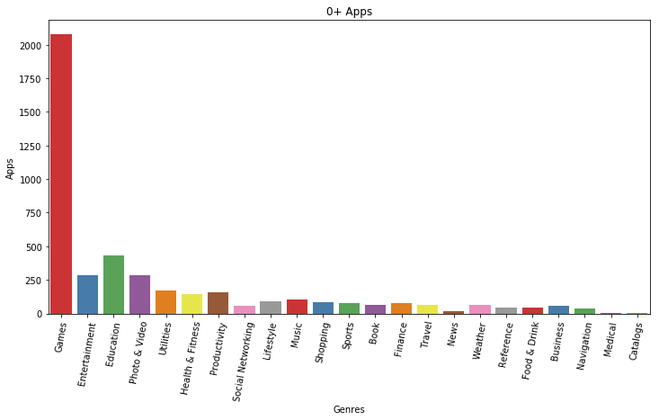
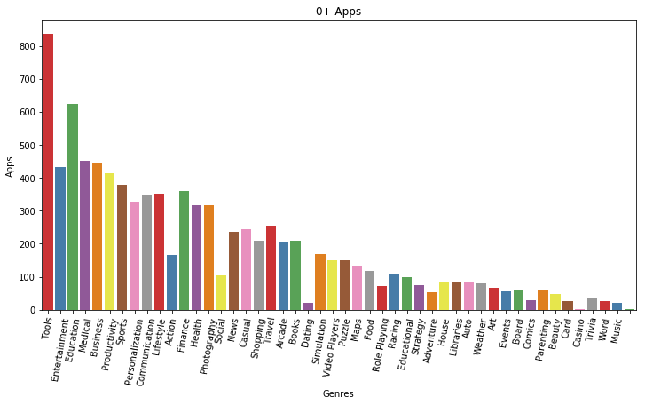
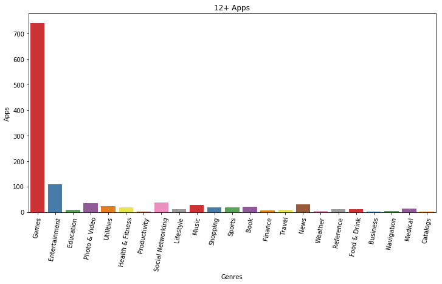
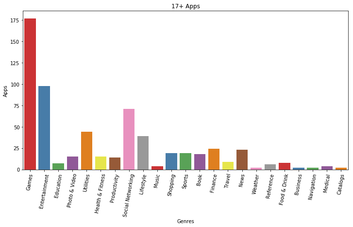
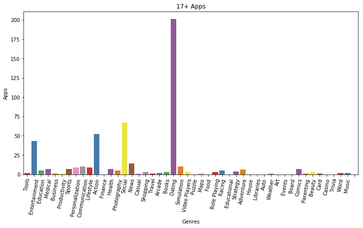

.. Data Visualization Website documentation master file, created by
   sphinx-quickstart on Tue Nov 20 12:04:49 2018.
   You can adapt this file completely to your liking, but it should at least
   contain the root `toctree` directive.

Welcome to Data Visualization Website's by Thu & Zach!
======================================================

.. toctree::
   :maxdepth: 2
   :caption: Table of Contents:

The goal of this project is to practice the analytical skills we learn throughout this semester. We choose the datasets and ask ourselves what kind of question we can and want to answer from our sources.
We build this website to share what we have learned and discovered from that journey.

Why Mobile Apps?
---------------------

Let's ask ourselves: How many times a day do you pick up your phone and not use an app?

Well, that is very rare. In fact, we access the Internet 24/7 to be able to constantly communicate on the go. It could be Facebook, Messenger, Snapchat, or Instagram, etc. some popular apps. The increasing number of smartphone users has led to a dramatic increase in the number of apps that consumers use on their phones. According to `Statista <https://www.statista.com/statistics/269025/worldwide-mobile-app-revenue-forecast/>`_, In 2020, mobile apps are projected to generate 188.9 billion U.S. dollars in revenues via app stores and in-app advertising. This is a huge industry.

Hence, by analyzing the data from two of the biggest market places, we want to answer one big question:

**What are the current trends and future prospects of mobile apps development?**

That is a crucial question to explore in many cases. Since mobile apps are becoming more and more popular, an excellent resource for engaging, interacting and communicating with your customers. Imagine you are a bussiness owner who want to launch an app for your service, before hiring a development team to handle the technical side, you need a big picture of your target market. Will your app be offer to a wide range of people? Are there any content rating you need to concern? What is the cost to install? Those questions are critical to generate your revenue from the app and its effectivity. Fortunately, we have the data to help us solve the problem. By predicting the trend and future prospects of mobile apps, you will then easily identify your direction to develop your own app.

Data Acquisition
---------------------

We started by going to Kaggle and retreiving two datasets.
  * `Apple Store dataset <https://www.kaggle.com/ramamet4/app-store-apple-data-set-10k-apps>`_
  * `Google Store dataset <https://www.kaggle.com/lava18/google-play-store-apps>`_
These two datasets give us a big picture of mobile apps since Google Store and App Store are now the two largest sources in the mobile application market. Taken as a whole, the data shows some interesting correlations on top of a vast list of information about apps and prices. These two are extremely valuable to compare in the big picture. However, one disadvantage of these datasets is that we could not merge them together since the app ID/Name is not identical. While working with the data, we have to go back and forth between the two datasets to make correlations. 

Knowing the disadvantages of our data, each of us work with one dataset, but we had to set some rules to make sure our workflow was consistent with the other’s:

#. Formulate the clean dataset. Looking at the data we got, think of how it is going to look like after cleaning, which variable will be useful, which variable we could not utilize will be eliminated.
#. Identify the area we do not want in our dataset.
#. Standardize our variable names. Each colum in each dataset will be renamed the same way. We all use lower case, underscore to separate to word. this is to make sure it’s easy to reference both datasets in a uniform fashion.

Data Cleaning
---------------

Overview
++++++++++++++++++++
We collect more than 7,100 data points from Apple App Store and approximately 10,100 data points from Google Play App Store. We focus on app title, category, developer name, rating, number of reviews, app size, number of installs, and price.

Importing packages
++++++++++++++++++++
We start by importing packages as one should do. Since we are working with CSV data, we will need *pandas* to read our data. Other packages will be helpful for visualization.

.. code-block:: python

    import pandas as pd
    import numpy as np
    import seaborn as sns
    import matplotlib.pyplot as plt

Renaming and Dropping 
+++++++++++++++++++++++
As we said earlier, in order to work with two separate datasets we needed to standardize each of them; so we started by renaming those columns that we believe is going to be used for further analysis and getting rid of unnecessary items. Zach made his changes directly on his CSV file from Excel while Thu used Python in the notebook. We did not want to limit our tools when approaching data. Note that Thu dropped some columns and renamed others in the following code. Zach deleted 8 columns consisting of “ID”, “Currency”, “Rating_count_ver”, “User_rating_ver”, “sup_device_num”, “ipadSC_url”, “Lang_num”, “vpp_lic”. 

.. code-block:: python

    googleStore.rename(columns={'App': 'app', 'Rating': 'rating', 'Reviews': 'reviews', 'Size': 'size', 'Price': 'price', 'Genres': 'genres'}, inplace=True)
    googleStore = googleStore.drop(columns=['Category', 'Installs', 'Type', 'Last Updated', 'Current Ver', 'Android Ver'])

For more details, let's take a look at `this notebook <notebooks/Google\ Data.ipynb>`_ to see how I used the tools we learned to clean up the data. 

App Distribution by Genres
----------------------------

Price distribution of apps by genres
++++++++++++++++++++++++++++++++++++++++++

Here we can see a significant difference between two marketplaces. The apps from Apple App Store that fall into Games category make the most money while it is Finance for Google Play.

.. figure:: notebooks/AppleStore/GenrePrice.png
    :alt: Apple App Store
    :width: 80%
    :align: center
    
    Apple App Store

.. figure:: notebooks/GoogleStore/GenrePrice.png
    :alt: Google Play App Store
    :width: 80%
    :align: center
    
    Google Play App Store

Content rating distribution by genres
+++++++++++++++++++++++++++++++++++++++

When we were looking at the variables we found that relating content rating with the number of apps that existed in these categories could be interesting, first we filtered out the apps that are “0+”, basically E for Everyone, these are interesting since we have mainly “Games” for the apple store data and then a majority of “Tools” for the google play store. The thing that we got from this is that Google Play Store doesn’t have a Genre related to “Games”, but they separate it into other categories such as “Action”, “Entertainment”, “Arcade”, and other categories that the apps would fit into. It is also clear to anyone looking at these graphs that on the apple store “Games” are the most common app, while the Google Play Store has a wide diversity of categories. Another fun thing to point out is that the Google Play Rated R is mainly “Dating” apps, interesting.

    
    Apple App Store

    
    Google Play App Store

    
    Apple App Store

.. figure:: notebooks/GoogleStore/GenreTypeT.png
    :alt: Google Play App Store
    :width: 80%
    :align: center
    
    Google Play App Store

    
    Apple App Store

    
    Google Play App Store

Most expensive apps by genres 
+++++++++++++++++++++++++++++++

Let's look at `the notebook <notebooks/Google\ Data.ipynb>`_ for most expensive apps by genres on Google Play. 
How about Apple App Store? Let's find out in `this notebook <notebooks/AppleStore.ipynb>`_.

Free Apps vs. Paid Apps
----------------------------

Free vs Paid apps counts
+++++++++++++++++++++++++++++++++++++++

Another common visualization method that we didn’t go over is Pie Charts, we thought they would be an excellent way to show off the data from the two separate datasets. There is a large difference between the “Pay-To-Play” scene on the two separate app stores. As we can see the Apple Store has 43.6% of their apps with a price tag on them while the Google Store only has about 7.4% of their apps with a price tag on them. 

.. figure:: notebooks/AppleStore/PieChartFreeVSPaid.png
    :alt: Apple App Store
    :width: 60%
    :align: center
    
    Apple App Store

.. figure:: notebooks/GoogleStore/PieChartFreeVSPaid.png
    :alt: Google Play App Store
    :width: 60%
    :align: center
    
    Google Play App Store

Rating of Free vs Paid apps
+++++++++++++++++++++++++++++

Next, we decided to look into the rating distribution of free apps versus paid apps to see if there is a difference in satisfaction between whether people preferred free versus paid apps. Something that we see a lot of is the amount of apps with 0.0 rating(929 for apple, 1474 for google), we can assume that this just means they don’t have any ratings. The next thing that we noticed is that there is quite an odd outlier, for the Google App Store we encountered an app with a rating of 19.0 in the free apps, we truly aren’t sure what made this app so good that it broke the 0.0-5.0 system but it’s there, named “Life Made WI-Fi Touchscreen Photo Frame”.

.. figure:: notebooks/AppleStore/UserRatingFreeVSPaid.png
    :alt: Apple App Store
    :width: 80%
    :align: center
    
    Apple App Store

.. figure:: notebooks/GoogleStore/UserRatingFreeVSPaid.png
    :alt: Google Play App Store
    :width: 80%
    :align: center
    
    Google Play App Store

Content Rating Distribution
---------------------------------------

We then chose to look at the totals of all the different content ratings of all the apps on the App Stores to see if one store was more “Family Friendly” compared to the next. Apple Store had roughly 800 Rated R apps while the Google Store had a whopping 3… Needless to say, the Google Store had a astounding 9131 “E for Everyone” Apps while Apple had roughly 4300...

.. figure:: notebooks/AppleStore/ContentRatingCount.png
    :alt: Apple App Store
    :width: 80%
    :align: center
    
    Apple App Store

    
    Google Play App Store

Size Comparison
-------------------------------

Back to Pie Charts! Assuming that the size of the apps in bytes would be roughly the same since they had some overlapping apps as well as apps can’t be too large or else people would be a bit weary about giving up a bunch of storage on their devices. What we stumbled upon was once again surprising, we used the .describe to find the mean of Google Play’s “size” and then we changed roughly away from the mean in order to get 20MB as our threshold. The Apple Store had 90.2% of apps above the average of Google Play’s size, we assumed that this would be understandable as the Apple Store has more paid apps and therefore the apps must have more work put into them, making them larger.  

.. figure:: notebooks/AppleStore/PieChartLargeVSSmall.png
    :alt: Apple App Store
    :width: 60%
    :align: center
    
    Apple App Store

.. figure:: notebooks/GoogleStore/PieChartLargeVSSmall.png
    :alt: Google Play App Store
    :width: 60%
    :align: center
    
    Google Play App Store

Amount of reviews
-----------------------

The last thing we chose to analyze was the amount of reviews that certain apps received. Google was very heavy on their review count as they had roughly 13.7% of their apps with OVER 250,000 reviews! The Apple store had a significantly less amount of apps with over 250,000 reviews, only being about 1.1% meeting this threshold, mostly apps with large followings such as Candy Crush, Facebook, Instagram, etc. 

.. figure:: notebooks/AppleStore/PieChartAppReviews.png
    :alt: Apple App Store
    :width: 60%
    :align: center
    
    Apple App Store

.. figure:: notebooks/GoogleStore/PieChartAppReviews.png
    :alt: Google Play App Store
    :width: 60%
    :align: center
    
    Google Play App Store

Summary
------------

Apple App Store
+++++++++++++++++

  * The “Games” category makes the most revenue from the Apple App Store. This category also has the biggest number available for everyone to download. This explains its popularity due to no age limit as well as people’s gravitation towards games. 
  * Games app also take the crown for the biggest number of apps available in every content rating category.
  * Free apps and Paid apps approximately equally divide the marketplace.
  * Rating distribution between free and paid apps are nearly the same. 
  * 90% of apps from Apple App Store are large apps which takes more than 20MB in your device memory.

Google Play Store
++++++++++++++++++++ 

  * Finance category make the most revenue from app store. 
  * Genres distributions vary between each content rating age. Tool apps lead the content for everyone while entertainment are most popular among teenagers. Interestingly, there is a tremendous amount of dating apps for adults.
  * Free apps and Paid apps have significant difference in numbers.
  * However, rating distribution between free and paid apps are nearly the same. 
  * 2/3 of apps from Google Play Store are small apps which takes less than 20MB in your device memory.
  * It seems like apps from Google Play receive more reviews than they are in Apple Store.

Conclusion
------------

With all the commotion around Phones and more specifically, Apps, there is little to dispute when we bring up the fact that it is an ever growing business with a nearly limitless audience as well as potential to become bigger every second. It is also very important to point out that there is a large difference when it comes to getting your app into these two separate stores; it is a fairly easy process to get your app into the Google Store while it is quite difficult to get past Apple’s standards for apps on their store. This can skew the data as we have a very diluted store as opposed to a store that has a set of standards to even attempt to get in. This analysis is just the tip of the iceberg when it comes to the online entertainment industry since the internet is an ever-growing industry, there needs be constant analysis of the trends that prove to make certain platforms successful and we hope to have intrigued your thought process of the App Industry. 

Indices and tables
==================

* :ref:`genindex`
* :ref:`modindex`
* :ref:`search`
