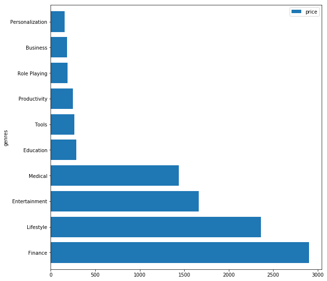

.. Data Visualization Website documentation master file, created by
   sphinx-quickstart on Tue Nov 20 12:04:49 2018.
   You can adapt this file completely to your liking, but it should at least
   contain the root `toctree` directive.

Welcome to Data Visualization Website's by Thu & Zach!
======================================================

.. toctree::
   :maxdepth: 2
   :caption: Table of Contents:

The goal of this project is to practice the analytical skills we learn throughout this semester. We choose the datasets and ask ourselves what kind of question we can and want to answer from our sources.
We build this website to share what we have learned and discovered from that journey.

   
Data Acquisition
---------------------

We started by going to Kaggle and retreiving two datasets.
  * `Apple Store dataset <https://www.kaggle.com/ramamet4/app-store-apple-data-set-10k-apps>`_
  * `Google Store dataset <https://www.kaggle.com/lava18/google-play-store-apps>`_
These two datasets give us a big picture about mobile apps since Google Store and App Store are now two biggest sources in the market. Taken as a whole, the data shows some interesting correlations more than just a vast list of apps and prices. These two are extremely valuable to compare as a big picture. However, one disadvantage of these dataset is that we could not merge them together since the app ID is not identical. Hence, when working with the data, we have to go back and forth between two datasets.

Knowing the disadvantage of our data, each of us work with one dataset but we have some rules to make sure our workflow are consistent and on the same page:

#. Formulate the clean dataset. Looking at the data we got, think of how it is going to look like after cleaning, which variable will be useful, which variable we could not utilize will be eliminated.
#. Identify the area we do not want in our dataset.
#. Standardize our variable names. Each colum in each dataset will be renamed the same way. We all use lower case, underscore to separate to word.

Why Mobile Apps?
---------------------

Let's ask ourselves: How many times a day do you pick up your phone and not use an app?

Well, that is very rare. In fact, we access the Internet 24/7 to be able to constantly communicate on the go. It could be Facebook, Messenger, Snapchat, or Instagram, etc. some popular apps. The increasing number of smartphone users has led to a dramatic increase in the number of apps that consumers use on their phones. According to `Statista <https://www.statista.com/statistics/269025/worldwide-mobile-app-revenue-forecast/>`_, In 2020, mobile apps are projected to generate 188.9 billion U.S. dollars in revenues via app stores and in-app advertising. This is a huge industry.

Hence, by analyzing the data from two of the biggest market places, we want to answer one big question:

**What are the current trends and future prospects of mobile apps development?**

That is a crucial question to explore in many cases. Since mobile apps are becoming more and more popular, an excellent resource for engaging, interacting and communicating with your customers. Imagine you are a bussiness owner who want to launch an app for your service, before hiring a development team to handle the technical side, you need a big picture of your target market. Will your app be offer to a wide range of people? Are there any content rating you need to concern? What is the cost to install? Those questions are critical to generate your revenue from the app and its effectivity. Fortunately, we have the data to help use solve the problem. By predicting the trend and future propects of mobile apps, you will then easily identify your direction to develop your own app.

Data Cleaning
---------------

Overview
++++++++++++++++++++
We collect more than 7,100 data points from Apple App Store and approximately 10,100 data points from Google Play App Store. We focus on app title, category, developer name, rating, number of reviews, app size, number of installs, and price.

Importing packages
++++++++++++++++++++
We start by importing packages. Since we are working with CSV data, we will need *pandas* to read our data. Other packages will be helpful for visualization.

.. code-block:: python

    import pandas as pd
    import numpy as np
    import seaborn as sns
    import matplotlib.pyplot as plt

Renaming and Dropping 
+++++++++++++++++++++++
As we talked earlier, in order to work with two separate dataset, we need to standardize each of them. So we started by renaming those columns that we believe is going to be used for further analysis and getting rid of unnecessary items. Zach made his changes directly on his CSV file from Excel while I used Python. We did not want to limit our tools when approaching data.
Note that I dropped some columns and renamed others in the following code.

.. code-block:: python

    googleStore.rename(columns={'App': 'app', 'Rating': 'rating', 'Reviews': 'reviews', 'Size': 'size', 'Price': 'price', 'Genres': 'genres'}, inplace=True)
    googleStore = googleStore.drop(columns=['Category', 'Installs', 'Type', 'Last Updated', 'Current Ver', 'Android Ver'])

For more details, let's take a look at `this notebook <notebooks/Google\ Data.ipynb>`_ to see how I used the tools we learned to clean up the data. 

App Distribution by Genres
----------------------------

The price distribution of apps by genres
-------------------------------------------------

.. subfigstart::

.. _price-genre-base:

.. figure:: notebooks/AppleStore/GenrePrice.png
    :alt: Apple App Store
    :width: 90%
    :align: center
    
    Apple App Store

.. _price-genre-original:

    
    Google Play App Store

.. subfigend::
    :width: 0.30
    :alt: Price Distribution
    :label: price-genre

    The blah bkah

Total price of paid apps in each genre
----------------------------------------

Bar Chart for count of content rating
---------------------------------------

Pie chart for free vs paid apps counts
------------------------------------------

pie chart for size comparison
-------------------------------

pie chart for reviews
-----------------------

most expensive apps by genres 
--------------------------------

bar chart for rating of free vs paid apps
--------------------------------------------

content rating by genres
--------------------------

Conclusion
------------
With all the commotion around Phones and more specifically, Apps, there is little to dispute when we bring up the fact that it is an ever growing business with a nearly limitless audience as well as potential to become bigger every second. This analysis is just the tip of the iceberg when it comes to the online entertainment industry, since the internet is a ever-growing industry, there needs be constant analysis of the trends that prove to make certain platforms successful and we hope to have intrigued your thought process of the App Industry. 

Indices and tables
==================

* :ref:`genindex`
* :ref:`modindex`
* :ref:`search`
